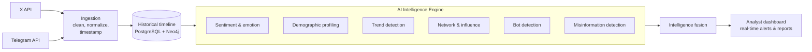

<div align="center">

# TraceX

### See what is trending, who is driving it, where it spreads, and how people feel about it.

**AI-powered social intelligence and information-flow analytics for X and Telegram**

<br/>


<br/>


</div>

<br/>

## Table of contents

- [The problem](#the-problem)
- [The solution](#the-solution)
- [Product tour](#product-tour)
- [How it works](#how-it-works)
- [Why TraceX is different](#why-tracex-is-different)
- [Tech stack](#tech-stack)
- [Privacy by design](#privacy-by-design)
- [Getting started](#getting-started)
- [Roadmap](#roadmap)
- [Team](#team)

<br/>

## The problem

Social-media data is scattered across platforms and tools. Analysts can see that something is trending, but not clearly **who is driving it**, **where it is spreading**, or **how audience sentiment is shifting**.

<div align="center">

| **70%** | **6+** | **60%** |
|:---:|:---:|:---:|
| of critical online narratives are detected only *after* they trend | separate tools often needed for a complete analysis | of analyst time is spent collecting and preparing data |

</div>

By the time a coordinated or misleading narrative is visible, it has usually already spread.

<br/>

## The solution

**TraceX** unifies X and Telegram into a single, time-aware intelligence dashboard. It collects conversations continuously, stores a historical timeline, and runs a full AI analysis stack on top of it.

<div align="center">

| WHAT is trending? | WHO is driving it? | WHERE is it spreading? | HOW is sentiment changing? |
|:---:|:---:|:---:|:---:|
| Trend and topic detection | PageRank influence analysis | Community and propagation graph | Sentiment and emotion over time |

</div>

<br/>

## Product tour

TraceX is organised into eight modules, reachable from one sidebar. Every screen shares the same filters: platform, time window, and language.

### 01 · Mission Control

One operating view across X and Telegram: posts tracked, active narratives, average sentiment, high-risk alerts, a live alert feed, and pipeline health.


<br/>

### 02 · Trend Explorer

Emerging narratives are ranked by growth against a historical baseline, each with a **risk score**. A filterable table tracks keywords and hashtags by volume, 24-hour change, platform split, and risk.


<br/>

### 03 · Sentiment & Emotion

Positive, neutral and negative composition over 30 days, with automatic **shift-event detection** and a six-class emotion model: support, opposition, anxiety, anger, joy and curiosity.


<br/>

### 04 · Demographics & Audience Cohorts

Who is in the conversation, at cohort level only: state-level geography, age brackets, interests, and a language split that treats **Hinglish as a first-class category**. Every figure is aggregated with k-anonymity of at least 50.


<br/>

### 05 · Network & Influence

Replies, mentions and reposts become a directed graph. **PageRank** sizes influence, **Louvain** colours communities, and a propagation trace highlights how a narrative cascades between groups. Bot-linked nodes are flagged directly on the graph.


<br/>

### 06 · Bot Detection & Misinformation Radar

Accounts are scored from 0 to 1 using behavioural signals: posting frequency, account age, duplicate content and timing patterns. A second tab tracks claim-level misinformation, correlating risk with bot activity and spread pattern.


<br/>

### 07 · Alerts & Reports

Every detection lands in one triage log with severity, type and status filters. Analysts can export CSV logs and generate intelligence briefs that bundle KPIs, findings, bot clusters and the misinformation dossier.


> **Note:** figures in the screenshots come from the prototype's demonstration dataset.

<br/>

## How it works



| Module | Approach | Output |
|---|---|---|
| **Demographics** | spaCy NER for explicit traits (location, language); Gemma 4 for implicit traits (age bracket, interests); aggregated and anonymized | Audience cohorts |
| **Sentiment & emotion** | TF-IDF with keyword frequency; emotion classes; tracked over time | Net sentiment, emotion mix, shift events |
| **Trend detection** | TF-IDF, topic modelling, comparison with historical baseline | Emerging narratives, abnormal spikes |
| **Bot detection** | Post frequency, account age, duplicates, timing patterns | Bot probability score (0 to 1) |
| **Network analysis** | Replies, mentions, reposts as a graph; PageRank and community detection | Influencers and propagation paths |
| **Misinformation** | Claim extraction, fact-check API cross-check, correlation with bot score and spread | Misinformation risk score |
| **Fusion & dashboard** | Combines trends, sentiment, audience, network and risk | Dashboard, alerts, reports |

<br/>

## Why TraceX is different

| | Sprinklr | Brandwatch | **TraceX** |
|---|---|---|---|
| **Cost** | Enterprise-only, high pricing | $6K to 15K+ per year | **Free or low-cost** |
| **Focus** | Customer experience suite | Market research | **Governance, disaster response, public sentiment** |
| **Platforms** | Broad, paid tiers | Broad, paid tiers | **X, Telegram and more, unified** |
| **Network mapping** | Basic share-of-voice | Surface-level influencers | **PageRank, communities, propagation paths** |
| **Misinformation** | Not a core feature | Not a core feature | **Built in** |
| **Bot activity** | Limited or add-on | Limited or add-on | **Native bot probability scoring** |

**In short:**

- **Unified** content, audience, trends and networks in one platform
- **Information-flow focus** that tracks propagation, not just volume
- **Multilingual** analysis built for India's code-mixed content
- **Early detection** with time-aware baselines
- **Integrity native**: bots and misinformation are core modules, not add-ons

<br/>

## Tech stack

| Layer | Technology |
|---|---|
| Language | Python |
| Data sources | X API, Telegram API |
| NLP & AI | spaCy, Gemma 4 |
| Storage | PostgreSQL (time-series), Neo4j (graph) |
| Streaming & orchestration | Apache Kafka, Apache Airflow |
| Analytics | scikit-learn, NetworkX |
| Visualization | Plotly, Streamlit |

<br/>

## Privacy by design

Social-media monitoring raises real concerns about surveillance and transparency. TraceX is built to answer them.

- **Aggregate only.** Audience insight is reported at cohort level with k-anonymity of at least 50.
- **No individual profiling.** The system analyses narratives, communities and networks.
- **PII suppressed at ingest**, with data minimization and access controls.
- **Confidence scores** accompany model outputs so analysts can judge reliability.

<br/>

## Getting started

> Adjust these steps to match your repository layout.

```bash
# 1. Clone the repository
git clone https://github.com/<your-username>/<your-repo>.git
cd <your-repo>

# 2. Create a virtual environment
python -m venv .venv
source .venv/bin/activate        # Windows: .venv\Scripts\activate

# 3. Install dependencies
pip install -r requirements.txt
python -m spacy download en_core_web_sm

# 4. Add your API credentials
cp .env.example .env             # then fill in X and Telegram keys

# 5. Launch the dashboard
streamlit run app.py
```

<br/>

## Roadmap

- [x] Unified X + Telegram ingestion and historical timeline
- [x] Sentiment, emotion, demographics, trends, network, bot and misinformation modules
- [x] Real-time alerts and exportable analyst reports
- [ ] Additional platforms: Instagram, Facebook, Reddit, YouTube
- [ ] Deeper multilingual fine-tuning for regional languages and slang
- [ ] Custom alert rules and scheduled briefings

<br/>

## Team

**Team Perplexus** · Smart India Hackathon 2026 · Problem Statement 26152

| Name | Role | GitHub |
|---|---|---|
| _Your name_ | _Role_ | [@username](https://github.com/username) |
| _Member 2_ | _Role_ | [@username](https://github.com/username) |

<br/>

<div align="center">

**Built for a safer, more informed India.**

</div>
